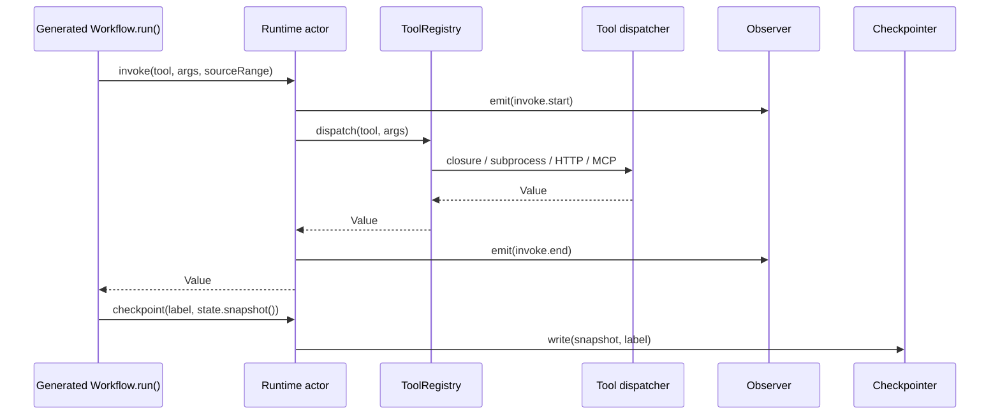

# Meridian: A Code Walkthrough

*2026-05-01T10:16:59Z by Showless dev*
<!-- showless-id: 73eb4635-83eb-42b3-b4ee-1c33230e8f4a -->

Meridian is a controlled natural language compiler. You write workflows in
English-shaped prose — `to process an order placed by a customer:` — and the
compiler turns them into typed, async/await Swift that runs against a small
deterministic runtime. There is no LLM in the hot path: parsing, lowering,
and codegen are pure functions of the source text.

The codebase is around 28,000 lines of Swift across roughly 130 files, split
into five Swift Package products: `MeridianRuntime` (the runtime actor),
`MeridianCore` (the compiler), `MeridianTools` (built-in HTTP/file/MCP
tools), `MeridianTestKit` (test harnesses), and the `meridian` CLI. Two
design decisions define everything else. First, the compiler is **strict by
default** — every unresolved phrase, unparseable rule, or unattached rule is
a hard error at a real source location, not a silent fallback. Second,
business rules and workflows go through the same lowering pipeline: a `must
not` rule becomes an `assert` IR primitive prepended to the matching
workflow, just as if the author had written it inline.

The walkthrough below follows the data: tokenize, parse, resolve symbols,
lower to IR, inject rules, emit Swift, then explain the runtime that
generated code calls into. By the end you should be able to add a new IR
primitive end-to-end without re-reading the AGENTS handbook.

**Key features.**

- English-shaped surface. `.meridian` files read like an attentive product
  brief; `.merconfig` files declare the vocabulary (kinds, properties,
  relations, phrases, tools, instances, constants).
- Eleven IR primitives. `invoke`, `bind`, `branch`, `iterate`, `assert`,
  `emit`, `wait`, `commit`, `recover`, `simultaneously`, `proseStep`,
  `complete` — that is the whole language at the IR level.
- Strict by default. Unresolved phrases and rules raise `CompilerError`s.
  Per-file `allow-fallbacks:` frontmatter opts back into laxer modes.
- Typed Swift output. Domain kinds become `struct`s conforming to marker
  protocols (`MeridianThing`, `MeridianService`, …); generated workflow
  inits accept those types directly.
- Replay-safe resume. Generated code restores `State` from a checkpoint and
  skips already-executed side-effects using stable progress labels.
- Two prose modes. `with discretion` calls a `Planner` for a bounded plan;
  `with autonomy` calls an `ActPlanner` one step at a time with replan
  budgets. Both still route every action through validation, host policy,
  and scoped-tool checks.


The pipeline has one direction: source flows left-to-right, with `SymbolTable`
as the only join point — it caches every kind, phrase, and tool declared in
the merconfig so the lowerer can resolve `the order's total amount` without
re-walking the AST. `RuleInjector` runs after `ASTToIR` lowers workflows but
before `SwiftEmitter` runs, so injected `assert`s and synthesised triggers
look identical to author-written IR. Generated Swift never imports
`MeridianCore`; it only depends on `MeridianRuntime`.

## Repository shape

Before diving into individual files, get a feel for the size and shape.

### Six modules, three of them load-bearing

```bash
ls Sources

```

```output
MeridianCLI
MeridianCore
MeridianRuntime
MeridianTestKit
MeridianTools
SampleDemoFlows
```

Six top-level Swift modules. The interesting work happens in `MeridianCore`
(the compiler), `MeridianRuntime` (the actor that generated code talks to),
and `MeridianTools` (the Blueprint built-in tools). `MeridianCLI` is a thin
ArgumentParser wrapper. `SampleDemoFlows` holds the hand-written reference
workflow used as a pre-codegen ground-truth.

### Eighteen thousand lines of source, almost ten thousand of tests

```bash
find Sources -name "*.swift" | wc -l | xargs printf "Swift sources: %s\n"
find Tests -name "*.swift" | wc -l | xargs printf "Swift test files: %s\n"
find Sources -name "*.swift" -print0 | xargs -0 wc -l | tail -1 | awk '{print "Source lines: "$1}'
find Tests   -name "*.swift" -print0 | xargs -0 wc -l | tail -1 | awk '{print "Test lines:   "$1}'
find examples -type f \( -name "*.meridian" -o -name "*.meri" -o -name "*.merconfig" \) | wc -l | xargs printf "Sample workflow/vocabulary files: %s\n"

```

```output
Swift sources: 89
Swift test files: 52
Source lines: 18484
Test lines:   9895
Sample workflow/vocabulary files: 25
```

Almost ten thousand lines of tests for eighteen thousand lines of source —
roughly a 1:1.9 ratio. Most of those tests are forcing functions: they
compile a real `.meridian` file end-to-end and assert structural properties
on the result. The 25 sample workflows under `examples/` double as goldens.

### Five heaviest files map to the five hardest problems

The five heaviest source files map almost exactly to the five hardest
problems in the codebase — runtime coordination, code generation, parsing,
lowering, and AST shape.

```bash
find Sources -name "*.swift" -print0 | xargs -0 wc -l | sort -n | tail -8 | head -7

```

```output
     614 Sources/MeridianRuntime/Tools/ToolRegistry.swift
     764 Sources/MeridianCore/Parser/Productions/MerConfigParser.swift
     795 Sources/SampleDemoFlows/GeneratedOrderProcessing/OrderProcessing.swift
     842 Sources/MeridianCore/Lowering/ASTToIR.swift
    1037 Sources/MeridianRuntime/Runtime.swift
    1057 Sources/MeridianCore/Parser/Productions/StatementParser.swift
    1098 Sources/MeridianCore/Codegen/SwiftEmitter.swift
```

`SwiftEmitter`, `StatementParser`, and `Runtime` are each over 1000 lines —
that is where the leverage is. `OrderProcessingDemo` (the 795-line entry)
is special: it is *generated* output, checked into the repo so the Phase 4
round-trip test can golden-diff against it without invoking the compiler.

We will visit each of these in turn. The chapters follow the lifecycle of
a single source file from text to running Swift, then circle back to
runtime, tooling, and the test runner.

## 1. The Compiler Facade — Compiler.swift

`MeridianCore/Compiler.swift` is the smallest entry point that exposes the
entire pipeline. Every CLI command, every test fixture, every spec runner
goes through `Compiler.compile(meridianSource:meridianFile:vocabularies:)`.

```bash
sed -n '14,39p' Sources/MeridianCore/Compiler.swift

```

```output
    public struct Options {
        public var emitterOptions: SwiftEmitter.Options
        /// Diagnostic trace sink. Defaults to the process-wide `ParserTrace.shared`,
        /// which is silent unless `MERIDIAN_TRACE` env var or `--trace` CLI flag
        /// activates categories.
        public var trace: ParserTrace
        /// English surface table used for comparison markers, duration units,
        /// articles, prepositions, and stop-words. Defaults to the built-in
        /// English lexicon; supply a custom instance to extend or override vocabulary.
        public var lexicon: EnglishLexicon
        /// Test-/host-level escape hatch for fallbacks. **The user-facing way
        /// to opt into fallbacks is the `.meridian` frontmatter
        /// `allow-fallbacks:` key.** This option is OR-merged with the
        /// frontmatter policy at compile time. Default: `.strict` (every
        /// resolution failure raises a hard error).
        public var fallbackPolicy: FallbackPolicy
        public init(emitterOptions: SwiftEmitter.Options = .init(),
                    trace: ParserTrace = .shared,
                    lexicon: EnglishLexicon = .default,
                    fallbackPolicy: FallbackPolicy = .strict) {
            self.emitterOptions = emitterOptions
            self.trace = trace
            self.lexicon = lexicon
            self.fallbackPolicy = fallbackPolicy
        }
    }
```

### The Options struct sets the entire personality of a compile

Four knobs configure everything: `emitterOptions` decides whether to embed
source-line comments and what indent unit to use; `trace` is the opt-in
diagnostic logger; `lexicon` is the English-surface table the parser uses
for comparison markers, articles, and duration units; and `fallbackPolicy`
controls strict-vs-lenient behaviour. The defaults are aggressive — strict
mode, silent trace, the canonical English lexicon — so a fresh `Compiler()`
call already does the right thing for production use. The lexicon is
swappable so a Spanish or German front-end can be plugged in without
touching the parser.

### Multi-vocabulary is the real pipeline

The single-vocabulary `compile(meridianSource:meridianFile:merconfigSource:
merconfigFile:)` is a thin wrapper that delegates to the multi-vocab path.
Real compiles can pull in several `.merconfig` files: the e-commerce one
gives you orders and customers, the github one gives you pull requests and
checks, and the runner file simply imports both.

```bash
sed -n '120,148p' Sources/MeridianCore/Compiler.swift

```

```output
        // Parse + merge every supplied .merconfig.
        var config = MerConfigFile()
        var seenNames: Set<String> = []
        for input in vocabularies {
            if !seenNames.insert(input.name).inserted {
                throw CompilerError.semanticError(
                    message: "duplicate vocabulary name: \(input.name)",
                    range: SourceRange(file: input.file, line: 1, column: 1)
                )
            }
            let parsed = try MerConfigParser(trace: trace, lexicon: lexicon).parse(input.source, file: input.file)
            config = config.merging(parsed)
        }
        try requireUniqueDeclarations(in: config)

        // Apply language synonyms from merged config into the effective lexicon.
        lexicon = lexicon.merging(
            comparisonSynonyms: config.languageSynonyms.comparisonSynonyms,
            durationSynonyms: config.languageSynonyms.durationSynonyms
        )

        // Use the first vocabulary file (if any) for symbol-table source
        // attribution; multi-vocab attributes still flow through the merged
        // config's individual statement source lines.
        let symbolsFile = vocabularies.first?.file ?? "config.merconfig"
        let symbols = SymbolTable.build(from: config, sourceFile: symbolsFile, trace: trace, lexicon: lexicon)

        let ast = try MeridianParser(symbols: symbols, trace: trace, lexicon: lexicon).parse(meridianSource, file: meridianFile)
        try validateImports(ast.imports, against: vocabularies, file: meridianFile)
```

Notice the order. Vocabularies parse first, get merged into one
`MerConfigFile`, and then language synonyms from `=== language ===`
sections are folded into the effective lexicon. Only then does the
`.meridian` file parse — so a custom comparison phrase like "is bigger
than" defined in vocabulary works in workflow source. `validateImports`
afterwards catches typos: an `import shipping.` with no matching
`VocabularyInput` raises a sourced `semanticError` pointing at the import
line.

### Frontmatter merges with the host policy

Per-file fallback opt-ins are OR-merged with the host's `Compiler.Options`.
Authors stay in control of their file; hosts (test fixtures, CI agents) can
loosen things globally without rewriting source.

```176:189:Sources/MeridianCore/Compiler.swift
        // Merge the frontmatter `allow-fallbacks:` policy (if any) with the
        // option-level escape hatch. The resulting policy is the union.
        var effectivePolicy = options.fallbackPolicy
        if let raw = ast.metadata?["allow-fallbacks"] {
            let (frontPolicy, unknown) = FallbackPolicy.parse(raw)
            effectivePolicy = effectivePolicy.merging(frontPolicy)
            for token in unknown {
                trace.log(.lowering, "frontmatter allow-fallbacks: unknown kind '\(token)' (allowed: \(FallbackKind.allCases.map(\.rawValue).joined(separator: ", ")))")
            }
        }
```

The trick is that unknown fallback kinds in frontmatter are *not* fatal —
they get logged through the trace channel. This keeps newer compilers
forward-compatible with merconfigs from older ones.

### Domain decl is built from vocabulary

The compiler walks the vocabulary one more time to build a `DomainDecl` —
the typed Swift counterpart to the kind hierarchy. Property enums
(`one of (active, suspended, closed)`) get hoisted to top-level Swift enums
named `<Kind><Property>`; inheritance chains are flattened so each emitted
struct holds the ancestor properties directly. This is the single
buildDomain call that bridges `MerConfigFile` to `SwiftEmitter`'s
`DomainEmitter`.

## 2. The IR — IRTypes.swift

Before parsing, look at where parsing is going. `IRTypes.swift` is the
intermediate representation: 11 primitive operations that every `.meridian`
program eventually lowers to. This file is small — 438 lines — but it is
the contract between the front-end (parser, lowerer, rule injector) and
the back-end (emitter, runtime). Touching this file means touching every
other file in the compiler.

### Eleven primitives, one indirect enum

The whole language sits in a single `IRPrimitive` indirect enum.

```bash
sed -n '91,104p' Sources/MeridianCore/IR/IRTypes.swift

```

```output
public indirect enum IRPrimitive: Sendable {
    case invoke(InvokeIR)
    case bind(BindIR)
    case branch(BranchIR)
    case iterate(IterateIR)
    case assert(AssertIR)
    case emit(EmitIR)
    case wait(WaitIR)
    case commit(CommitIR)
    case recover(RecoverIR)
    case simultaneously(SimultaneouslyIR)
    case proseStep(ProseStepIR)
    case complete(CompleteIR)
}
```

That is the entire computational vocabulary. `invoke` calls a tool, `bind`
introduces a name, `branch` is `if/else` and pattern match, `iterate` is
`for/while/until`, `wait` parks until a signal/approval/event, `commit`
labels a checkpoint, `recover` attaches an error handler, `simultaneously`
runs branches in parallel, `proseStep` hands off to a planner or autonomy
loop, and `complete` ends the workflow with a reason. There is no `try`,
no `catch`, no `defer`, no `throw` — error flow is data, carried by
`RecoverIR.pattern` and matched at runtime.

### Wait conditions are sum-typed, not stringly-typed

Most "wait until X" systems take a string and parse it at runtime. Meridian
flattens the four legal shapes into an enum at compile time.

```278:283:Sources/MeridianCore/IR/IRTypes.swift
public enum WaitConditionIR: Sendable {
    case duration(Duration)
    case signal(String)
    case approval(of: IRExpression, by: String)
    case event(String, matching: IRExpression?)
}
```

This is the kind of small decision that sets the tone for the codebase.
The runtime's wait-queue dispatcher matches on the case directly, so the
parser cannot smuggle a malformed wait through to runtime; if a new wait
shape needs adding, every switch statement in `Runtime.swift` and
`SwiftEmitter.swift` becomes a compile error until you handle it.

### Expressions are an open recursive enum

`IRExpression` is the thing you build wherever a value is needed: as an
`InvokeArg`, an `EmitField` value, an `AssertIR.condition`, a
`BranchCondition.predicate`. Sixteen cases cover literals, identifier and
property reads, comparisons, logical combinations, environment variables,
`now`, and inline tool invocations. The newest case — `interpolatedString`
— is what makes `{{ order's id }}` work inside a fenced code block prompt
to an LLM.

### IRWorkflow carries a struct name and a discretion bit

Every workflow lowers to an `IRWorkflow` value with a derived UpperCamelCase
struct name (`to process an order` becomes `ProcessOrder`), an explicit
parameter list, an execution mode (`strict` or `lenient`), and a
`allowsDiscretion` flag set when the source header carries `, with
discretion`. These two metadata bits are how the emitter knows whether to
generate a normal `run()` body or one that calls `runtime.executeProsePlan`.

## 3. The AST — MeridianAST.swift

`MeridianAST.swift` (608 lines) holds the AST types for both file kinds:
`MerConfigFile` for vocabulary and `MeridianFile` for workflows. It is a
pure data file — no logic — but it is where you discover what the language
even *means*.

### One file, two ASTs, one merging operation

`MerConfigFile` and `MeridianFile` are different shapes. The merconfig
declares what *exists*; the meridian file describes what *happens*.

```bash
sed -n '38,55p' Sources/MeridianCore/AST/MeridianAST.swift

```

```output
    /// Concatenate two parsed merconfig files, preserving declaration order
    /// (left-hand sections first). Duplicate-name detection is the caller's
    /// job — `Compiler.merge` walks the merged symbol table and rejects
    /// colliding kind / phrase / tool names with a sourced error.
    public func merging(_ other: MerConfigFile) -> MerConfigFile {
        let mergedSynonyms = LanguageSynonyms(
            comparisonSynonyms: languageSynonyms.comparisonSynonyms + other.languageSynonyms.comparisonSynonyms,
            durationSynonyms: languageSynonyms.durationSynonyms.merging(other.languageSynonyms.durationSynonyms) { _, new in new }
        )
        return MerConfigFile(
            vocabulary: vocabulary + other.vocabulary,
            constants:  constants  + other.constants,
            instances:  instances  + other.instances,
            tools:      tools      + other.tools,
            languageSynonyms: mergedSynonyms
        )
    }
}
```

The fields are concatenated, never deduplicated. Duplicate detection is
deliberately pushed to `Compiler.requireUniqueDeclarations`, which can
report a sourced error pointing at the second definition's line. The
`languageSynonyms` field is the new bit: a merconfig can declare its own
comparison verbs ("is bigger than" → `.greaterThan`) and they survive the
merge intact.

### StatementAST is the indirect enum that drives everything

The body of a workflow lowers to a `[StatementAST]`. The recursive cases
(`recover` holds an attached predecessor; `conditional` holds nested
blocks) are why the whole enum is `indirect`.

```bash
sed -n '328,344p' Sources/MeridianCore/AST/MeridianAST.swift

```

```output
public indirect enum StatementAST: Sendable {
    case bind(BindStatementAST)
    case rebind(RebindStatementAST)
    case emit(EmitStatementAST)
    case assertStmt(AssertStatementAST)
    case wait(WaitStatementAST)
    case commit(CommitStatementAST)
    case complete(CompleteStatementAST)
    case conditional(ConditionalStatementAST)
    case iteration(IterationStatementAST)
    case simultaneously(SimultaneouslyStatementAST)
    case recover(RecoverStatementAST)
    case labelled(LabelledStatementAST)
    case proseStep(ProseStepAST)
    case modal(ExecutionModeAST)
    case phraseInvocation(PhraseInvocationAST)

```

Most cases mirror the IR, with two exceptions. `phraseInvocation` is the
AST-only case for "anything that looks like a phrase from the merconfig" —
the lowerer resolves it against the symbol table and inlines the phrase's
own statements. `labelled` is for SKILL.md-shaped topic labels like
`Comments: complete.` which carry a heading but lower to whatever the
inner statement says. The runtime never sees these — they are pre-IR
sugar.

### Phrase patterns mix literals and parameters

The `=== vocabulary ===` section's phrase definitions become
`PhrasePattern` values. Each pattern is a list of segments — either a
literal token or a typed parameter slot.

```144:171:Sources/MeridianCore/AST/MeridianAST.swift
public struct PhrasePattern: Sendable {
    public let segments: [PatternSegment]
    public init(segments: [PatternSegment]) { self.segments = segments }

    public var parameters: [PhraseParameterAST] {
        segments.compactMap { if case .parameter(let p) = $0 { return p } else { return nil } }
    }

    public var displayText: String {
        segments.map {
            switch $0 {
            case .literal(let s): return s
            case .parameter(let p): return "a \(p.kind)"
            }
        }.joined(separator: " ")
    }
}

public enum PatternSegment: Sendable {
    case literal(String)
    case parameter(PhraseParameterAST)
}

public struct PhraseParameterAST: Sendable {
    public let name: String
    public let kind: String
}
```

`displayText` is what the symbol table tokenises to score phrase matches.
A phrase declared as `to validate an order:` becomes the segments `[validate,
{order:order}]`; an invocation like `validate the order` tokenises the same
way and the overlap score wins.

### Frontmatter is parsed once, kept verbatim

`FileMetadataAST` keeps frontmatter as an ordered `[(key, value)]` and
exposes a case-insensitive subscript. That is enough for the SKILL-style
metadata that `meridian preview-skill` and `swift run meridian docs`
consume.

## 4. The English Lexicon — EnglishLexicon.swift

Every parser, lowerer, and symbol-table operation takes an `EnglishLexicon`
parameter. That single struct holds every English-specific table the
compiler uses, so swapping it out is the path to a different surface
language without touching parser code.

### One struct, eight tables

The lexicon enumerates articles, prepositions, copulas, participles,
suffix heuristics, comparison markers, duration units, and tool stop-words.
Nothing else in the compiler hardcodes these.

```bash
sed -n '75,103p' Sources/MeridianCore/Language/EnglishLexicon.swift

```

```output
        comparisonMarkers: [
            // longest matches first — order matters
            ("is more than or equal to", .greaterOrEqual),
            ("is less than or equal to", .lessOrEqual),
            ("is no less than",          .greaterOrEqual),
            ("is no more than",          .lessOrEqual),
            ("is at least",              .greaterOrEqual),
            ("is at most",               .lessOrEqual),
            ("up to",                    .lessOrEqual),
            ("is greater than",          .greaterThan),
            ("is more than",             .greaterThan),
            ("is fewer than",            .lessThan),
            ("is less than",             .lessThan),
            ("is within",                .within),
            ("exceeds",                  .greaterThan),
            ("is not",                   .notEqual),
            ("is",                       .equal),
        ],
        durationUnits: [
            "ms": .millisecond, "millisecond": .millisecond, "milliseconds": .millisecond,
            "second": .second, "seconds": .second, "sec": .second, "secs": .second,
            "minute": .minute, "minutes": .minute, "min": .minute, "mins": .minute,
            "hour": .hour, "hours": .hour, "hr": .hour, "hrs": .hour,
            "day": .day, "days": .day,
            "week": .week, "weeks": .week,
        ],
        toolStopwords: ["a", "an", "the", "of", "for", "with", "from", "by", "to", "that",
                        "and", "or", "invoke", "call", "run"]
    )
```

The comment "longest matches first" is load-bearing. The `ExpressionParser`
walks this list in order and takes the first marker it finds inside the
expression, so `is more than or equal to` must come before `is more than`
must come before `is`. Reorder this list and you change the language. The
participle list looks like it could be heuristics, and `participleSuffixes`
covers most regular forms — but the explicit list catches irregular
participles (`given`, `taken`) that would otherwise be misread as
identifiers.

### Synonyms merge in from vocabulary

A `=== language ===` section in any merconfig contributes additional
comparison markers and duration units. They come back as a
`LanguageSynonyms` value that the compiler folds into the lexicon before
parsing the workflow file. This is how a domain-specific dialect ("is
strictly greater than") gets first-class support without modifying the
default English table.

### structName(_:) is the canonical natural-language → identifier rule

`IRWorkflow.structName(from:)` delegates straight to the lexicon. The
algorithm: take significant words (skip articles), stop at the first
preposition that introduces a parameter (`for`, `by`, `placed by`),
UpperCamelCase the rest. So `to process an order placed by a customer`
becomes `ProcessOrder`. Override the lexicon's preposition set and you
change every generated struct name.

## 5. Tokenizing and Parsing — IndentTokenizer + MeridianParser + StatementParser

The parser is split into three layers. `IndentTokenizer` reads source text
into `[SourceLine]` annotated with indent depth, list markers, heading
levels, and a synthetic case for fenced code blocks. `MeridianParser` walks
top-level structure (frontmatter, imports, rules, workflows).
`StatementParser` walks workflow bodies. Each is a value type that takes
a lexicon and a trace sink.

### SourceLine carries everything indent-sensitive parsing needs

The parser is indent-driven, not bracket-driven. Every line carries its
indent in spaces, the trimmed text, the original raw text, the 1-based line
number, and optional markdown surface metadata.

```bash
sed -n '15,32p' Sources/MeridianCore/Parser/Lexical/IndentTokenizer.swift

```

```output
/// A single line from a Meridian source file, with indent metadata.
public struct SourceLine: Sendable {
    public let indent: Int       // number of leading spaces (tabs count as 2)
    public let text: String      // stripped of leading/trailing whitespace + trailing "."
    public let raw: String       // original content
    public let number: Int       // 1-based line number
    public let listMarker: String?
    public let headingLevel: Int?

    public var isEmpty: Bool   { text.isEmpty }
    public var isComment: Bool { headingLevel == nil && text.hasPrefix("#") }
    public var isContent: Bool { !isEmpty && !isComment }

    /// Text with trailing "." stripped (most statements end with ".").
    public var statement: String {
        text.hasSuffix(".") ? String(text.dropLast()) : text
    }

```

The two convenience properties make body-walking ergonomic. `isContent`
filters out blanks and comments in one shot. `statement` drops the
trailing period that most lines end with — the parser is built to be
forgiving of authors who treat workflows like prose.

### Fenced code blocks collapse into a sentinel SourceLine

Triple-backtick fences are a special case. The tokenizer collapses an
entire fence — possibly many lines of markdown or template content — into
a single synthetic `SourceLine` whose `text` is a sentinel string that
encodes the language tag and a base64 of the body. Downstream parsers
recognise the sentinel prefix and decode it lazily.

```67,103p:Sources/MeridianCore/Parser/Lexical/IndentTokenizer.swift
    public func tokenize(_ source: String, file: String = "") -> [SourceLine] {
        var lines: [SourceLine] = []
        let rawLines = source.components(separatedBy: "\n")

        var i = 0
        while i < rawLines.count {
            let raw = rawLines[i]
            let indent = leadingSpaces(raw)
            let text = raw.drop(while: { $0 == " " || $0 == "\t" })
                          .trimmingCharacters(in: .whitespaces)

            // Detect a stand-alone opening fence: "```" or "```<language>"
            if text.hasPrefix("```") {
                let langTag = String(text.dropFirst(3)).trimmingCharacters(in: .whitespaces)
                let openingLineNumber = i + 1   // 1-based
                let baseIndent = indent
```

The two convenience properties make body-walking ergonomic. `isContent`
filters out blanks and comments in one shot. `statement` drops the
trailing period that most lines end with — the parser is built to be
forgiving of authors who treat workflows like prose.

### Fenced code blocks collapse into a sentinel SourceLine

Triple-backtick fences are a special case. The tokenizer collapses an
entire fence — possibly many lines of markdown or template content — into
a single synthetic `SourceLine` whose `text` is a sentinel string that
encodes the language tag and a base64 of the body. Downstream parsers
recognise the sentinel prefix and decode it lazily.

```67:103:Sources/MeridianCore/Parser/Lexical/IndentTokenizer.swift
    public func tokenize(_ source: String, file: String = "") -> [SourceLine] {
        var lines: [SourceLine] = []
        let rawLines = source.components(separatedBy: "\n")
        var i = 0
        while i < rawLines.count {
            let raw = rawLines[i]
            let indent = leadingSpaces(raw)
            let text = raw.drop(while: { $0 == " " || $0 == "\t" })
                          .trimmingCharacters(in: .whitespaces)
            if text.hasPrefix("```") {
                // … collapse fence into sentinel SourceLine …
            }
        }
        return lines
    }
```

The trick is that `SourceLine` did not need to grow a new field — the
sentinel travels in `text`. It is a Unicode private-use-area character, so
it can never collide with real source.

### MeridianParser walks frontmatter, imports, rules, workflows

The top-level parser has one job: split a `MeridianFile` into its four
sections in source order. Frontmatter must be first — only blank lines may
precede the opening `---`. The parser issues a precise error if a `---`
block appears anywhere else, so authors do not silently lose their
metadata.

### StatementParser is where the language earns its name

The hard work happens in `StatementParser.parseBlock`. It iterates content
lines, applies anaphora resolution (turning `it` into the most recent
referent), expands inline `do A, B, and C.` chains into separate
statements, then dispatches per leading keyword to a dozen small parsers.
Two subtleties are worth noting. First, `recover from …:` lines are
attached to the immediately preceding statement, not parsed as siblings —
this preserves the spec's "recover wraps the predecessor" semantics.
Second, `collectMultiLineCounted` returns both the joined text and the
number of consumed lines so the outer loop can advance correctly when a
multi-line phrase header spans several lines.

## 6. Vocabulary and Symbols — MerConfigParser + SymbolTable

`.merconfig` files declare the world: kinds, properties, relations, phrases,
tools, instances, constants. `MerConfigParser` reads them; `SymbolTable`
indexes them so the workflow lowerer can resolve "the order's total amount"
without re-walking the AST.

### Sections, not files

A merconfig is a sequence of `=== sectionname ===` blocks. Each section's
contents have their own grammar — vocabulary statements, constant
declarations, instance properties — and the parser dispatches per section.

```bash
sed -n '1,18p' examples/ecommerce.merconfig
echo "..."
sed -n '77,82p' examples/ecommerce.merconfig

```

```output
# ecommerce.merconfig
# Vocabulary, configuration, and tools for the order processing system.

=== vocabulary ===

# People

A person is a kind of thing.
A person has a name, an email, and a phone number.

A customer is a kind of person.
A customer has a status, which is one of (active, suspended, closed).
A customer has a credit limit, which is Money.
A customer has a tier, which is one of (standard, premium, enterprise).
A customer has a signup date, which is a Date.

An account manager is a kind of person.

...
# Phrase definitions

To validate an order:
  bind result = invoke validate order with id = the order's id.
  if the result's verdict is invalid,
    reject the order with reason "validation_failed".
```

This is the same `=== vocabulary ===` section that builds the `SymbolTable`
later. The `kind of thing` declarations build the `Customer` and `Order`
structs. The phrase definitions are reusable; `validate the order` from any
workflow is replaced inline by the body of `to validate an order:` during
lowering.

### sectionName has a sharp edge worth knowing

A long-standing bug had `MerConfigParser.sectionName` accepting purely-`=`
underline lines as section headers — every tool declaration after the
first was silently lost because `========================` was being read
as a (malformed, empty) section name. That is now rejected explicitly. Any
future change to header detection should keep this guard or risk dropping
tools.

### SymbolTable is built once and queried millions of times

`SymbolTable.build` walks the merged merconfig, splits it into typed
dictionaries keyed by lowercased name, then registers every workflow as a
phrase stub so workflows can call themselves and each other through normal
phrase matching.

```bash
sed -n '38,67p' Sources/MeridianCore/Symbols/SymbolTable.swift

```

```output
    public static func build(from config: MerConfigFile,
                             sourceFile: String = "",
                             trace: ParserTrace = .shared,
                             lexicon: EnglishLexicon = .default) -> SymbolTable {
        let table = SymbolTable(trace: trace)
        table.lexicon = lexicon
        for stmt in config.vocabulary {
            switch stmt {
            case .kind(let k):
                table.kinds[k.name.lowercased()] = k
            case .property(let p):
                table.properties[p.kind.lowercased()] = p.properties
                for entry in p.properties {
                    if case .enumeration(let cases) = entry.type {
                        for c in cases {
                            table.enumCases.insert(c.lowercased().trimmingCharacters(in: .whitespaces))
                        }
                    }
                }
            case .relation(let r):
                table.relations[r.verb.lowercased()] = r
            case .inverse:
                break  // tracked via relation in Phase 4
            case .phrase(var p):
                // attach sourceFile if not already set
                if p.sourceFile.isEmpty {
                    p = PhraseDefinition(pattern: p.pattern, body: p.body,
                                        sourceLine: p.sourceLine, sourceFile: sourceFile)
                }
                table.phrases.append(p)
```

Notice the asymmetry. Kinds, constants, and instances are stored in a
dictionary keyed by lowercased name. Phrases go into an array — they are
matched against invocations by token-overlap scoring, not by exact name.
The `enumCases` set is the small but important detail: when the lowerer
encounters a bare identifier like `denied` or `succeeded`, it can resolve
it to a string literal instead of emitting a stray `state.get("denied")`
lookup.

### Phrase matching anchors on the first significant word

The most consequential method on `SymbolTable` is `matchPhrase`. It walks
phrase candidates whose literal-token set contains the *first* significant
word of the invocation, scores each candidate by token overlap, and
returns the winner with its argument bindings. Anchoring on the first word
is what stops `reject the order with reason "insufficient_credit"` from
matching the unrelated `check the credit` phrase. The penalty for
unmatched literals (`overlap = 2·matched - 2·unmatched`) is what stops a
parent workflow stub from shadowing a more focused inner workflow when
both share several literal tokens.

## 7. Lowering — ASTToIR.swift

`ASTToIR` is the bridge from English-shaped AST to the eleven-primitive IR.
It is one of the heaviest files in the compiler at 842 lines, but its
structure is simple: one method per `StatementAST` case, plus the phrase
inliner.

### Workflows register as phrase stubs before lowering starts

The first thing `lower(_:)` does is install every workflow into the symbol
table as a phrase stub. This is what allows mutual and self-recursion: a
workflow body that says "process the order" resolves through the same
phrase-match path as any phrase invocation, and lowers to a workflow call
on the matching `IRWorkflow.structName`.

```37:46:Sources/MeridianCore/Lowering/ASTToIR.swift
        for wf in file.workflows {
            let structName = IRWorkflow.structName(from: wf.pattern.displayText, lexicon: lexicon)
            symbols.registerWorkflowPhrase(
                pattern: wf.pattern,
                structName: structName,
                sourceLine: wf.sourceLine,
                sourceFile: wf.sourceFile.isEmpty ? sourceFile : wf.sourceFile
            )
        }
        var workflows = try file.workflows.map { try lowerWorkflow($0) }
```

The stub has an empty body — the lowerer keys off `workflowStructName` and
emits an `InvokeIR(toolID: "workflow:ProcessOrder", …)` instead of trying
to inline a body that doesn't exist.

### Phrase invocations either inline or call

`lowerPhraseInvocation` is the dispatch function that decides what each
"sentence-shaped" line in a workflow becomes. The decision tree is:
explicit `invoke …` → `InvokeIR`; phrase-match-with-`workflowStructName`
→ workflow call; phrase-match without struct name → recursive inlining of
the phrase body (depth-limited to 8 to prevent runaway recursion); no
match → either `_unresolved` placeholder under lenient mode or a hard
`semanticError` under strict mode.

### Argument substitution sorts by descending key length

Inlining a phrase body means replacing parameter names with the
caller-side expressions. The substitution iterates arguments by descending
key length — `"total amount"` substitutes before `"amount"` so the
shorter key cannot clobber the start of the longer one. This is the kind
of invariant that has bitten the codebase enough times to become a load-
bearing comment in `AGENTS.md`.

### Discretion and autonomy bypass deterministic phrase matching

The single sentence "Discretion/autonomy bodies are never deterministic"
captures the contract. A workflow declared `, with discretion` lowers
each body line straight to a `ProseStepIR(.planThenExecute)`; a workflow
declared `, with autonomy` lowers to `ProseStepIR(.autonomousLoop)`. The
runtime then routes those steps to the planner or autonomy loop instead
of executing them as deterministic IR. This is enforced unconditionally —
even if a body line happens to match a phrase, the prose path wins for
discretion/autonomy workflows.

## 8. Business Rules — RuleLowering + RuleInjector

A `RuleAST` looks like an English sentence ("an order with total amount
more than the high value threshold must be approved by an account manager
before fulfillment"). The `RuleAnalyzer` classifies these sentences into
five typed `ParsedRule` cases; `RuleInjector` then prepends `assert` or
`wait` IR primitives to whichever workflow the rule's verb-and-subject
matches. The whole system makes business rules *first-class* — they live
beside workflows in the source file but lower into the same IR.

### Five rule shapes, classified by surface keyword

The classifier dispatches on a single keyword family per shape: `When` is
a trigger, ` must be …by …before ` is an approval precondition, ` must
not ` is an invariant or parameter guard, ` may ` is a permission. Anything
that does not match any shape is an unparseable rule, which is a strict-
mode error.

```70:95:Sources/MeridianCore/Lowering/RuleLowering.swift
    public func classify(_ rule: RuleAST) -> ParsedRule? {
        let text = rule.text.trimmingCharacters(in: .whitespaces)
        let lower = text.lowercased()

        if lower.hasPrefix("when ") {
            return classifyTrigger(text, rule: rule)
        }
        if lower.contains(" must be ") && lower.contains(" by ") && lower.contains(" before ") {
            return classifyPrecondition(text, rule: rule)
        }
        if lower.contains(" must not ") {
            return classifyMustNot(text, rule: rule)
        }
        if lower.contains(" may ") {
            return classifyPermission(text, rule: rule)
        }
        return nil
    }
```

It is a small function and that is by design — every classifier is one
ladder of `range(of:)` calls. There is no NLP, no tokenizer, no
ambiguity. The parser refuses anything it cannot recognise structurally.

### RuleInjector prepends asserts to the matching workflow

A parameter guard rule like "a customer must not place an order whose total
amount is more than their credit limit" parses into a `parameterGuard`
with predicate `total amount > credit limit`. The injector finds every
workflow whose name contains both the subject ("customer") and the verb
("place"), qualifies the predicate's bare identifiers (`total amount` →
`order.totalAmount`, `their X` → `customer.X`), then prepends an `assert
not predicate` to that workflow's body. The author writes the rule once;
every matching workflow gets the gate.

### Triggers fan out via events, not direct calls

Trigger workflows are a special case. They have no parameters of their
own — they wait on the trigger condition, then emit a fan-out event the
host subscribes to. The compiler still validates at compile time that the
action workflow exists; what it cannot do is dispatch with the right typed
parameters from the trigger's empty scope. So `When an order has been on
hold for 7 days, escalate the order …` becomes a tiny trigger workflow
that waits, then emits `trigger.<eventName>.fired`. The host wires the
event back to the typed `escalate-an-order` workflow with its own
parameter resolution.

## 9. Generating Swift — SwiftEmitter.swift

This is the heaviest file in the codebase: 1098 lines that turn an
`[IRWorkflow]` into a Swift source string. It is built on `StringTemplate`
from the `modelhike` dependency — a result-builder DSL that lets the
emitter look like the Swift code it produces.

### emitFile is a single declarative template

The top-level emitter is one `StringTemplate { … }` block that lists
every section in order: file header, optional domain types, optional
constants, optional instances, then one workflow per IRWorkflow. The
template flattens to a `[String]` when serialised, with `""` lines acting
as blank-line sentinels.

```bash
sed -n '78,105p' Sources/MeridianCore/Codegen/SwiftEmitter.swift

```

```output
        return StringTemplate {
            fileHeader()
            ""
            if let d = domainDecl {
                emitDomain(d)
                ""
            }
            if let c = constantsDecl {
                emitConstants(c)
                ""
            }
            if let i = instancesDecl {
                emitInstances(i)
                ""
            }
            for (idx, workflow) in workflows.enumerated() {
                // B1: Emit skillMetadata on the first workflow struct only.
                let skillEntries: [(String, String)]? = (idx == 0 ? fileMetadata?.entries : nil)
                emitWorkflow(workflow,
                             hasConstants: hasConstants,
                             hasInstances: hasInstances,
                             skillMetadata: skillEntries,
                             workflowParamTypes: paramTypes,
                             declaredKinds: declaredKinds)
                ""
            }
        }.toString(separator: "\n")
    }
```

The `paramTypes` map and `declaredKinds` set are pre-computed because the
emitter needs to know, at every call site, whether a given param-name
should be passed as a typed Swift value or wrapped in `Value.from(…)`.
The grammar permits workflow headers like `to plan a ci repair for a pull
request` even when `ci repair` is not a declared kind, so unknown kinds
fall back to `Value` to keep generated init signatures compileable.

### Each workflow becomes a struct conforming to MeridianWorkflow

`emitWorkflow` is the meat of the emitter. It produces a struct with a
`runtime`, one typed property per parameter, an `init`, and an async-
throwing `run()` method. The body of `run()` opens with the resume
context, defines the `__meridianShouldRun` replay guard, optionally
constructs `constants` and `instances`, fires `workflowStarted`, then
emits the workflow body block.

```164:189:Sources/MeridianCore/Codegen/SwiftEmitter.swift
            "    public func run() async throws -> WorkflowResult {"
            "        var state = State()"
            for bind in stateBinds { bind }
            "        let __meridianResumeContext = await runtime.consumeResumeContext()"
            "        if let __meridianResumeContext {"
            "            state.restore(from: __meridianResumeContext.restoredState)"
            "        }"
            "        var __meridianResumeTarget = __meridianResumeContext?.lastCheckpointLabel"
            "        func __meridianShouldRun(_ label: String) -> Bool {"
            "            guard let target = __meridianResumeTarget else { return true }"
            "            if target == label { __meridianResumeTarget = nil }"
            "            return false"
            "        }"
            if hasConstants {
                "        let constants = Constants()"
            }
            if hasInstances {
                "        let instances = Instances()"
            }
            "        await runtime.workflowStarted(workflowName: \"\(workflow.structName)\", parameters: [:])"
            ""
            emitBlock(workflow.body, ctx: ctx.in(2), workflow: workflow, path: "0")
```

Look at the resume-target trick. `__meridianShouldRun` returns `false` for
every label *up to and including* the last checkpoint that was written
before the previous run died, then returns `true` from the next label
onward. This is how a generated workflow safely replays after a crash
without redoing side-effecting `invoke`s or `emit`s.

### Replay-safe checkpointing is automatic

`shouldCheckpointAfter` decides which IR primitives get the replay-guard
treatment: invokes, emits, waits, asserts, and explicit commits. Every
guarded primitive sits inside an `if __meridianShouldRun(label) { …
checkpoint(label) }` envelope. The labels are stable, derived from
`progress:<idx>:L<sourceLine>:C<col>`, so the same compile always
produces the same labels.

### Comparisons go through MeridianComparison helpers

Generated code never compares `Value?` with Swift's `<`, `>`, or `==`
directly — Swift cannot do that. The emitter routes any comparison whose
operands are `Value?`-typed (state reads, identifier refs) through
`MeridianComparison.eq/lt/gt/...`, including the special
`MeridianComparison.isWithin(lhs, rhs)` for duration windows. This is the
single biggest reason generated Swift compiles cleanly under strict
concurrency.

## 10. Typed Domain Codegen — DomainEmitter.swift

`DomainEmitter` is a `SwiftEmitter` extension that builds the typed Swift
counterpart to merconfig kinds. It sits in 357 lines and handles the
hardest part of the codegen — turning a flat list of kinds into a chain
of marker protocols and concrete structs.

### Three emission paths per kind

Every kind picks one of three paths. Scalar parents (`String`, `Number`,
`Money`, …) collapse to a `typealias`. Kinds with own properties or named
descendants emit a `<Name>Kind` protocol plus a conforming struct. Kinds
that are leaves with no own properties emit just a struct conforming
directly to the resolved parent protocol — no empty protocol gets emitted.
That last case is an empty-protocol elision pass; without it,
`A comment is a kind of thing.` would produce a useless empty protocol.

```bash
sed -n '3,21p' Sources/MeridianRuntime/Domain/Thing.swift

```

```output
// MARK: - MeridianKind base + semantic protocols
//
// Every domain kind declared in a `.merconfig` whose parent isn't a primitive
// scalar (String, Number, …) lowers to a generated `<KindName>Kind` protocol +
// conforming `<KindName>` struct. The generated protocol composes one of the
// semantic bases below so the type system carries the kind's role through
// the workflow:
//
//     A pull request is a kind of thing.
//         → struct PullRequest: PullRequestKind
//         → protocol PullRequestKind: MeridianThing
//
//     An audit note is a kind of event.
//         → struct AuditNote: AuditNoteKind
//         → protocol AuditNoteKind: MeridianEvent
//
// `MeridianKind` is the structural baseline every semantic protocol composes.
// It carries the `Hashable`/`Codable`/`Sendable` conformances the runtime
// assumes (so `State`'s opaque traversal can JSON-round-trip dotted lookups)
```

The `Meridian` prefix is mandatory because several of the bare names
collide with existing types — `Event` is already a runtime telemetry
struct, `Process` is a Foundation class. Authoring tip: prefer the most
specific base. `A reviewer is a kind of role.` produces `Reviewer:
ReviewerKind: MeridianRole`, which lets host code constrain APIs to
"anything that's a role" without naming individual kinds.

### Inherited properties are flattened, not chained at runtime

When `customer is a kind of person`, the generated `Customer` struct has
its own properties *and* the flattened person properties — not just an
embedded `person` field. The compiler's `ancestorChain` walks the parent
chain in `Compiler.buildDomainDecl` and the inherited properties go into
`DomainEmitter`'s `inheritedProperties` field for ordered emission. This
means a single `Customer` value satisfies the entire protocol chain
without juggling parent instances.

## 11. The Runtime — Runtime.swift + Value.swift

`Runtime` is the actor that compiled workflows talk to. At 1037 lines it
is the largest single file in the runtime layer, but most of that is the
careful event-emission and wait-queue plumbing. The interface generated
code uses is small: `invoke`, `emit`, `wait`, `checkpoint`, `complete`.
Everything else is host configuration.

### A single actor coordinates every workflow run

The actor owns the tool registry, the observer (event sink), the
checkpointer, the clock, the permission registry, and the planner stack.
Hosts compose a `Runtime` once at startup and pass it into every workflow
struct's `init`.

```bash
sed -n '65,82p' Sources/MeridianRuntime/Runtime.swift

```

```output
    public init(
        toolRegistry: ToolRegistry,
        instanceRegistry: InstanceRegistry = .empty,
        observer: any Observer = JSONLObserver.stdout,
        checkpointer: any Checkpointer = InMemoryCheckpointer(),
        clock: any Clock = SystemClock(),
        runID: String = UUID().uuidString,
        parentRunID: String? = nil,
        parentSequence: Int? = nil,
        maxNestingDepth: Int = 32,
        permissionRegistry: PermissionRegistry = .empty,
        planner: any Planner = NoopPlanner(),
        actPlanner: any ActPlanner = NoopActPlanner(),
        discretion: any Discretion = DefaultDiscretion(),
        llmProvider: (any LLMProvider)? = nil,
        planningLimits: PlanningResourceLimits = .default,
        planPolicy: any PlanPolicy = AllowAllPlanPolicy()
    ) {
```

Notice the defaults. A `Runtime(toolRegistry: registry)` works out of the
box — JSONL observer to stdout, in-memory checkpointer, no planner, no
LLM. Hosts override what they need. This is the API generated code lives
on top of, so signature stability matters: adding a non-defaulted
parameter here breaks every emitted workflow file.

### Wait queues are typed, not stringly-keyed

Three queues live on the actor: signal waiters keyed by name, approval
waiters keyed by `(subject Value, role string)`, event waiters keyed by
event ID with an optional matching predicate. Each delivery API
(`deliverSignal`, `deliverApproval`, `deliverEvent`) walks the matching
queue and resumes continuations FIFO. The `withCheckedThrowingContinuation`
closure runs synchronously on the actor executor before suspension, so
the registration into actor-isolated storage is race-free without any
explicit locking.

### invoke is wrapped in three events

Every tool invocation emits `invoke.start`, then `invoke.end` or
`invoke.error`. The observer typically writes them as JSONL to an event
log. Argument payloads are run through the redaction policy before
emission, so `password` fields are blanked even in `invoke.start`.
This is the entire side-effect protocol — tools do work, the runtime
records everything.

### Value is the typed sum-type at every boundary

Every state binding, tool argument, tool return value, and event payload
field is a `Value`. The enum has a dozen cases — strings, numbers,
booleans, money, durations, dates, enum values, records, lists,
references, null, and an opaque box for typed Swift values that the
runtime cannot pattern-match.

```bash
sed -n '32,52p' Sources/MeridianRuntime/Value/Value.swift

```

```output
/// field is a Value.
public enum Value: Sendable {
    case string(String)
    case number(Decimal)
    case boolean(Bool)
    case money(Money)
    case duration(Duration)
    case date(Date)
    case dateTime(Date)
    case enumValue(String, kind: String)
    case record([String: Value])
    case list([Value])
    case reference(String)
    case null
    /// Holds custom Swift types not in the canonical set.
    /// The wrapped type must be both AnyObject (for equality) and Sendable.
    case opaque(AnyHashableSendable)

    public static let unit = Value.null
}

```

The `opaque` case is the escape hatch. When generated code passes a typed
`Order` struct as a workflow parameter, the runtime stores it as
`.opaque(AnyHashableSendable(order))`. `AnyHashableSendable` captures the
type's `Encodable` conformance at construction so `State.snapshot` can
JSON-round-trip the value across a checkpoint without losing fidelity.
This is one of the few places in the codebase that needs `@unchecked
Sendable` and it's worth its weight.

## 12. Tools and Planning — ToolRegistry + Planner + PlanExecutor

The runtime does not implement tools — it dispatches to them. Tools are
registered into a `ToolRegistry` actor at host startup and dispatched
through one of four `ToolKind` cases: an in-process closure, a subprocess,
an HTTP endpoint, or an MCP-spec call.

### Four tool kinds, one dispatch protocol

`ToolKind` is the discriminator; `ToolRegistry.dispatch` switches on it.
Closures run in-process for cheap things (`uuid.generate`, `time.now`),
subprocesses fork external binaries (`shell.run`), HTTP tools post JSON
(`http.get`, `http.post`), and MCP tools speak Model Context Protocol over
HTTP-JSONRPC or stdio.

```7:16:Sources/MeridianRuntime/Tools/ToolRegistry.swift
public enum ToolKind: Sendable {
    case closure(@Sendable ([String: Value]) async throws -> Value)
    /// Subprocess tool — implemented in Phase 5.
    case subprocess(SubprocessSpec)
    /// HTTP tool — implemented in Phase 5.
    case http(HTTPSpec)
    /// MCP tool — deferred to v1.1.
    case mcp(MCPSpec)
}
```

The closure case is what `MeridianTools.registerBuiltins()` uses for the
Blueprint built-ins. Hosts add their own domain tools the same way, with
optional `ToolSchema` arguments so the planner can validate proposals
against required and typed fields.

### Planner is the contract for "with discretion"

A workflow declared `, with discretion` lowers each body line to a
`ProseStepIR(.planThenExecute)`. At runtime, that step calls the
`Planner.plan(_:)` method with a `PlanContext` describing the prose,
state snapshot, available tools, and a max-actions budget.

```bash
sed -n '3,32p' Sources/MeridianRuntime/Planning/Planner.swift

```

```output
public protocol Planner: Sendable {
    func plan(_ context: PlanContext) async throws -> PlanProposal
}

public struct PlanContext: Sendable {
    public let prose: String
    public let snapshot: StateSnapshot
    public let tools: [ToolSchema]
    public let maxActions: Int

    public init(
        prose: String,
        snapshot: StateSnapshot,
        tools: [ToolSchema],
        maxActions: Int = 32
    ) {
        self.prose = prose
        self.snapshot = snapshot
        self.tools = tools
        self.maxActions = maxActions
    }
}

public struct PlanProposal: Sendable {
    public let actions: [ProposedAction]
    public let rationale: String?

    public init(actions: [ProposedAction], rationale: String? = nil) {
        self.actions = actions
        self.rationale = rationale
```

The protocol is intentionally tiny. A `Planner` returns a list of
`ProposedAction`s, each with a tool ID, arguments, and optional result
binding. Hosts plug in `LLMBackedPlanner` for production, `MockPlanner` or
`ScriptedPlanner` for tests. The runtime then validates every proposed
action through `PlanExecutor` before invoking it.

### PlanExecutor is the validation gauntlet

Every proposed action runs four checks before reaching `runtime.invoke`:
the tool must be in the prose step's scoped-tools set, the tool must be
registered, every required schema argument must be supplied, and every
supplied argument must match its schema type. A failure produces a typed
`MeridianRuntimeError.planningFailure` with one of the codes in
`PlanningFailureCode` (`planning.tool_out_of_scope`,
`planning.missing_tool_argument`, …). The host can `recover from
"planning.tool_out_of_scope":` to handle these surgically.

### Autonomy adds replan budgets and goal predicates

`with autonomy` lowers to `ProseStepIR(.autonomousLoop)` carrying an
`AutonomyConfigIR(until:, unless:, replanAfterFailures:, maxSteps:)`.
The runtime calls the `ActPlanner` one step at a time, evaluates the
optional `until` (success stop) and `unless` (abort) predicates against
the loop snapshot before each turn, and replans after the configured
failure threshold. After every accepted action the loop snapshot — with
the planner's result bindings merged in — is checkpointed, so resume
restores the loop's mid-progress state correctly.



This is the canonical "what happens when generated code runs an `invoke`"
sequence. The actor sandwiches the dispatch between two events; the
checkpoint is written after the call returns. If the workflow crashes
between the `invoke.end` and the checkpoint write, replay is safe: the
next run sees no checkpoint for that label, runs the invoke again, and
the runtime's `__meridianShouldRun` envelope makes that the only repeated
work.

## 13. The CLI and the Test Runner — CLI.swift + MeridianTestRunner.swift

The CLI is a thin ArgumentParser shell over the compiler and runtime. The
test runner is a pure library — no `print`, no `exit` — that any host can
re-use. Together they form the "outside" of the project: how authors
invoke the compiler and how CI verifies that nothing regresses.

### Eleven subcommands, each delegating to MeridianCore

The CLI lists every subcommand explicitly. There is no plug-in mechanism —
each command is a Swift type with `@Option` and `@Argument` properties.

```bash
sed -n '9,29p' Sources/MeridianCLI/CLI.swift

```

```output
@main
struct MeridianCLI: AsyncParsableCommand {
    static let configuration = CommandConfiguration(
        commandName: "meridian",
        abstract: "Compiler and runtime tools for the Meridian language.",
        version: "0.1.0-alpha",
        subcommands: [
            CompileCommand.self,
            LintCommand.self,
            PreviewSkillCommand.self,
            CheckCommand.self,
            FormatCommand.self,
            DocsCommand.self,
            TestCommand.self,
            TraceRenderCommand.self,
            RunCommand.self,
            VerifyCommand.self,
            ResumeCommand.self
        ]
    )
}
```

`compile` writes Swift to disk; `check` parses-only; `lint` runs the
`MeridianLinter`; `format` calls `MeridianFormatter`; `docs` renders the
merconfig as Markdown via `MerconfigDocsRenderer`; `test` walks
`.meridian.test` specs; `trace render` consumes JSONL event logs;
`run` compiles into a temporary SwiftPM package and executes; `verify`
re-runs a workflow against checked-in goldens; `resume` loads a
`FilesystemCheckpointer` snapshot and prepares a runtime resume context.
The `run` command is the only one that builds a temporary package — every
other command is in-process.

### Run shells out to a generated SwiftPM package

`RunCommand` is a small but striking design choice. To execute generated
Swift, the CLI builds a throwaway SwiftPM package on the fly, runs `swift
run` inside it, and pipes the JSONL event stream back. This keeps the CLI
itself free of dynamic Swift loading. `SwiftPMPackageRunner` in
`MeridianCore/Testing/` owns the package scaffolding, so test fixtures
re-use the same code path.

### MeridianTestRunner is a pure library

The `meridian test` subcommand is a thin shell over
`MeridianTestRunner.discover(at:)` and `runner.run(spec)`. There is no
`print`, no process exit; the runner returns typed results that the CLI
formats. IDE plugins, CI runners, and MCP endpoints reuse this exact API
with their own reporting layer.

```bash
sed -n '11,27p' Sources/MeridianCore/Testing/MeridianTestRunner.swift

```

```output
//
//     name: order processing happy compile
//     description: verifies compile + golden diff
//     source: examples/order_processing.meridian
//     vocab: examples/ecommerce.merconfig
//     golden_swift: examples/golden/order_processing_expected.swift
//     no_line_comments: true
//     expect_workflow_count: 2
//     expect_no_unresolved:
//     expect_invoke_tool: validate an order
//     expect_run: true
//     tool_stub validate an order: {"verdict": "valid"}
//     input order: {"id":"o-001","status":"submitted"}
//     expect_event_kinds_prefix: workflow.started
//     expect_run_succeeded: true
//
// See docs/09_MERIDIAN_TESTS.md for the full format reference.
```

A `.meridian.test` spec is a flat key-value document with named expectations.
The runner parses it, runs the compile, optionally runs the workflow with
stubbed tools, and asserts on the resulting event stream. Specs are the
fastest way to add a new regression test — no Swift required.

### ParserTrace is the diagnostic backbone

When a test fails or a compile produces unexpected output, `ParserTrace`
is the way in. Categories (`phrase.parse`, `phrase.match`, `lowering`,
`merconfig`) can be flipped on via `MERIDIAN_TRACE=phrase,lowering` or
`--trace phrase,lowering`. Output goes to stderr by default, or can be
captured programmatically with `ParserTrace.capturing(categories:)` for
unit tests. This is how you debug "why did `screen the order for fraud`
not match the screen-an-order phrase?" — turn on `phrase.match` and read
the candidate scoring trace.

### A real compile takes about a second

The whole pipeline runs in-process, with no I/O outside source reads.
Compiling the order-processing example through the CLI's `check`
subcommand parses both files, builds the symbol table, lowers to IR,
emits Swift, and reports the result.

```bash
sed -n '1,18p' Sources/SampleDemoFlows/GeneratedOrderProcessing/OrderProcessing.swift

```

```output
// THIS FILE IS GENERATED BY MERIDIAN. DO NOT EDIT.
// Source: order_processing.meridian
// Meridian IR version: 1.0

import Foundation
import MeridianRuntime

// B7: Runtime helper for {{ expr }} interpolation in fenced code blocks.
private func meridianStringify(_ v: Value) -> String {
    switch v {
    case .string(let s): return s
    case .number(let n): return "\(n)"
    case .boolean(let b): return b ? "true" : "false"
    case .null: return ""
    default: return v.description
    }
}

```

This is the head of the committed generated file used by the Phase 4
round-trip test. Notice the `meridianStringify` helper — added when the
B7 `{{ expr }}` interpolation feature landed — and the bare `import
MeridianRuntime`. Generated code does not depend on the compiler at all;
it is regular Swift you could read, type-check, or hand-edit (though the
header is asking nicely that you don't).

## 14. Putting it together

The whole pipeline in one paragraph: source enters `IndentTokenizer`,
which produces `[SourceLine]`. `MerConfigParser` and `MeridianParser`
consume those lines into `MerConfigFile` and `MeridianFile` ASTs (defined
in `MeridianAST.swift`), with `StatementParser` and `ExpressionParser`
handling workflow-body statements and expressions respectively, and
`PhrasePatternParser` decoding phrase pattern slots. `Compiler.swift`
merges multiple merconfigs and validates imports. `SymbolTable` indexes
the merged vocabulary and registers every workflow as a recursive phrase
stub. `ASTToIR` (with the help of `RuleAnalyzer` and `RuleInjector`)
lowers ASTs into `[IRWorkflow]` values defined in `IRTypes.swift`,
threading the `EnglishLexicon` through every step. `SwiftEmitter` and its
`DomainEmitter` extension turn IR into Swift source, with replay-safe
checkpointing baked in. `ManifestEmitter` writes a companion JSON
manifest. The generated Swift compiles against `MeridianRuntime`, whose
`Runtime` actor coordinates `Value`-typed `State`, `ToolRegistry`,
`PermissionRegistry`, the wait queues, the `Observer` event sink, the
`Checkpointer`, the `Planner`/`ActPlanner`/`Discretion` slots, and the
`PlanExecutor` that validates planner proposals. Operationally,
`MeridianCLI` exposes `compile`, `check`, `lint`, `format`, `docs`,
`test`, `trace render`, `run`, `verify`, and `resume` subcommands;
`MeridianTestRunner` is the library that powers `meridian test`;
`ParserTrace` is the diagnostic backbone you reach for when something
unexpected happens.

The mental model that holds it all up: every stage is a pure value
transformation. Source → AST → IR → Swift. Rules and workflows go
through the same pipeline. Tools and planners are protocols hosts plug
in. Generated code never imports the compiler. You can hold the whole
thing in your head, and that is the point.

